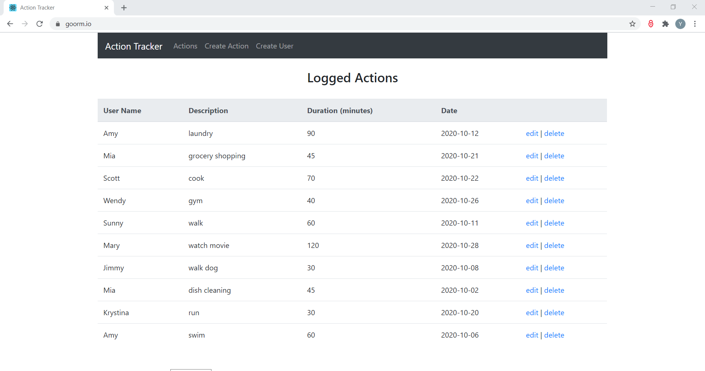
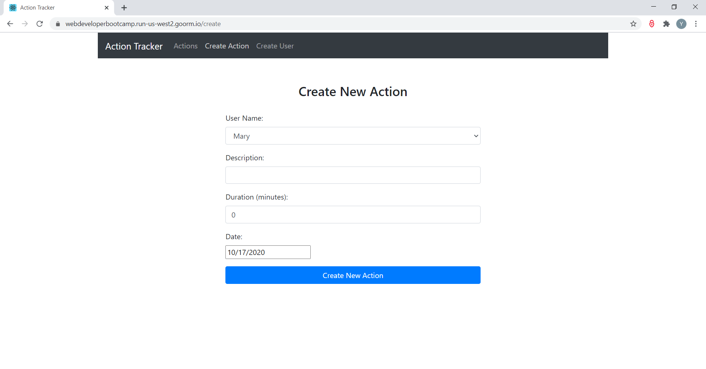
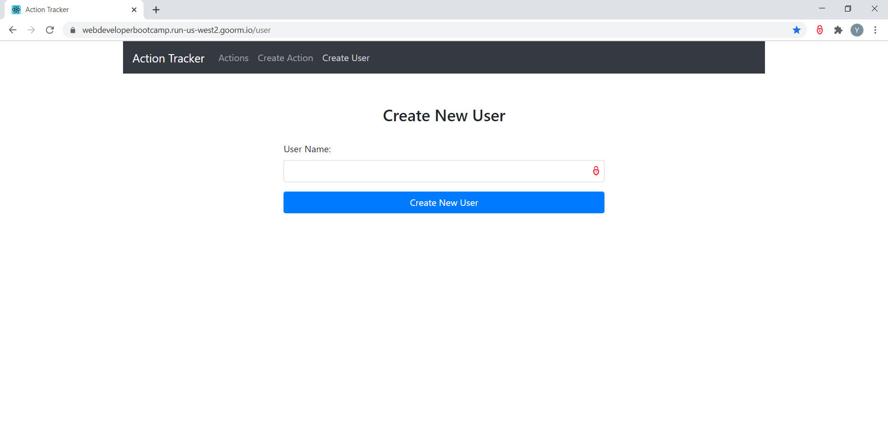

# Action Tracker

<ul>
  <li> A web application developed with goormIDE (a web-based cloud programming tool) for users to schedule and track everyday's actions </li>
  <li> Front-end was implemented using React with Bootstrap </li>
  <li> Back-end was implemented with Node.js and Express.js, and utilized mongoDB for data management </li>
</ul>

<h3> Action Log </h3>

<h3> Create New Action </h3>

<h3> Create New User </h3>

